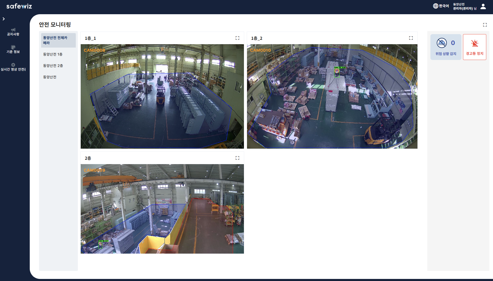
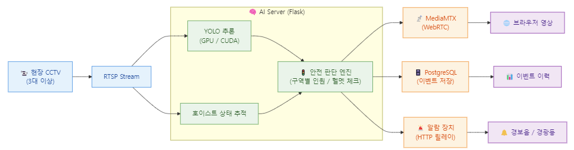
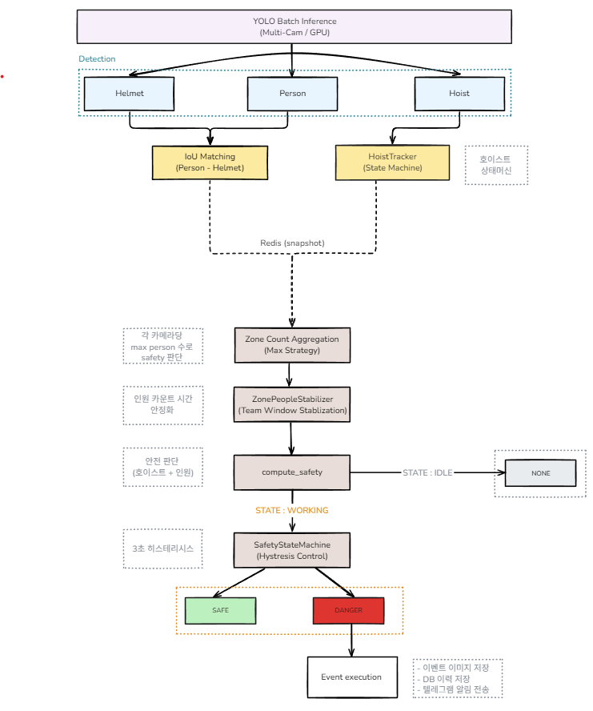

# CCTV 기반 크레인/호이스트 안전 모니터링 AI 서버

> **CCTV 기반 호이스트 작업 안전 모니터링 AI 서버**
> 안전모, 작업자, 호이스트 객체 인식을 기반으로 작업 중 위험 상황 감지 모니터링 시스템

## 모니터링 화면


## 시스템 아키텍처


## 목차

- [주요 기능](#주요-기능)
- [기술 스택](#기술-스택)
- [프로젝트 구조](#프로젝트-구조)
- [프로세스 아키텍처](#프로세스-아키텍처)
- [설치 및 실행](#설치-및-실행)
- [환경 설정](#환경-설정)
- [API 엔드포인트](#api-엔드포인트)
- [AI 추론 파이프라인](#ai-추론-파이프라인)
- [안전 판단 로직](#안전-판단-로직)


### 데이터 흐름

1. **영상 수집**: 현장 IP Camera(3대)로부터 RTSP 스트림 수신
2. **AI 추론**: YOLOv8 배치 GPU 추론으로 사람, 헬멧, 호이스트 실시간 감지
3. **Redis IPC**: 추론 결과(zone_counts, hoist_moving, jpeg_b64)를 Redis에 저장
4. **안전 판단**: State Manager가 Redis에서 데이터를 읽어 구역별 안전 상태 판정
5. **결과 출력**: 추론 영상을 MediaMTX(WebRTC)로 스트리밍, 위험 시 경보 장비 작동 + DB 기록 + 텔레그램 알림

---

## 주요 기능

### 멀티카메라 AI 안전 감시
- GPU 가속 YOLOv8 배치 추론 (사람, 헬멧, 호이스트 동시 감지)
- 멀티카메라 동시 프레임 수집 (Grabber 스레드)

### 호이스트 상태 추적
- 누적 이동거리 기반 IDLE/WORKING 상태머신 (HoistTracker)
- 카메라별 nearest-neighbor ID 배정 (HoistIDAssigner)
- 노이즈 필터링
  - 프레임 간 점프 > 150px 시 트래킹 리셋 (오감지 방지)
  - 미세 이동 < 3px은 누적거리에서 제외 (흔들림 무시)

### 구역 기반 안전 판단 (State Manager)
- 멀티카메라 MAX 집계 + 전 구역 인원 합산으로 통합 안전 판단
- ZonePeopleStabilizer: 시간 윈도우(1초) 기반 인원 수 안정화
- SafetyStateMachine: 3초 히스테리시스로 DANGER 오탐 방지
- DANGER 확정 시: 경보 릴레이 장비 ON (HTTP) + DB 이력 저장 + 텔레그램 알림
- SAFE 복귀 시: 경보 릴레이 장비 OFF

### CCTV 관리 REST API
- 카메라 CRUD (등록/조회/수정/삭제)
- AI 모델 관리 및 ROI 설정
- 모니터링 프로필 및 레이아웃 관리
- 이벤트 이력 조회 및 안전관리자 알림 설정

### 실시간 스트리밍
- RTMP → MediaMTX → WebRTC 변환
- 브라우저에서 AI 추론 결과 오버레이 영상 실시간 시청

---

## 기술 스택

### Backend
| 기술 | 버전 | 용도 |
|------|------|------|
| Python | 3.11 | 메인 언어 |
| Flask | 3.0.3 | REST API 프레임워크 |
| APScheduler | 3.10.4 | 백그라운드 작업 스케줄링 |
| psycopg2 | 2.9.9 | PostgreSQL 어댑터 |

### AI / ML
| 기술 | 버전 | 용도 |
|------|------|------|
| Ultralytics (YOLO) | 8.3.0+ | 객체 감지 모델 |
| PyTorch | 2.4.0 | 딥러닝 프레임워크 |
| OpenCV | 4.10.0 | 영상 처리 |
| CUDA | 11.8 | GPU 가속 |
| cuDNN | 9.1.0 | 신경망 라이브러리 |

### 영상 처리 / 스트리밍
| 기술 | 용도 |
|------|------|
| FFmpeg (NVENC/NVDEC) | 영상 인코딩/디코딩 |
| MediaMTX | RTSP/RTMP/WebRTC 미디어 서버 |

### 데이터베이스 / IPC
| 기술 | 용도 |
|------|------|
| PostgreSQL 15 | 메인 DB |
| TimescaleDB | 시계열 데이터 확장 |
| Redis 7 | 프로세스 간 통신 (IPC) |

### 인프라
| 기술 | 용도 |
|------|------|
| Docker | 컨테이너 배포 |
| Nginx | 리버스 프록시 |
| NVIDIA GPU | AI 추론 가속 |

---

## 프로젝트 구조
```
flask/
├── ai_server/
│   ├── app_Image_collection.py          # Flask 애플리케이션 진입점
│   │
│   ├── config/
│   │   ├── config.py                    # 환경 설정 (Config 클래스)
│   │   └── .env                         # 환경 변수
│   │
│   ├── blueprints/                      # REST API 모듈
│   │   ├── cctv_alarm.py                # 알람 릴레이 제어 (set_alarm)
│   │   ├── cctv_CRUD.py                 # 카메라 등록/수정/삭제 관리
│   │   ├── cctv_process.py              # AI 프로세스 실행 및 생명주기 관리
│   │   ├── cctv_remote.py               # 원격 제어 (시작/중지)
│   │   ├── master_event.py              # 이벤트 이력 관리
│   │   ├── master_model.py              # AI 모델 관리
│   │   ├── master_roi.py                # ROI 영역 설정 관리
│   │   ├── master_monitoring.py         # 모니터링 상세 정보 관리
│   │   ├── monitoring_profile.py        # 모니터링 프로필 설정
│   │   ├── safety_manager_CRUD.py       # 안전 관리자 정보 관리
│   │   ├── server_CRUD.py               # AI 서버 정보 관리
│   │   └── user.py                      # 사용자 인증 및 계정 관리
│   │
│   ├── rtsp_service/                    # AI 추론 및 상태 관리 모듈
│   │   ├── rtsp_ai_one_zone.py          # AI 추론 엔진 (YOLO 배치 추론 + RTMP 송출)
│   │   ├── state_manager.py             # 안전 상태 판단 프로세스 (Redis → 판정 → 이벤트)
│   │   └── lib/                         # 공용 라이브러리
│   │       ├── zone_utils.py            # 구역 집계, 안정화, 안전 판단 로직
│   │       ├── hoist_tracker.py         # 호이스트 상태머신, ID 배정
│   │       ├── detection_utils.py       # IOU 계산, ROI 판별, bbox 유틸
│   │       ├── streaming.py             # Grabber, FrameCache, RTMP 스트리밍
│   │       ├── telegram_alert.py        # 텔레그램 알림 전송
│   │       ├── public_func.py           # DB 유틸, JSON 직렬화
│   │       └── box_utils.py             # 바운딩 박스 관련 유틸 함수
│   │
│   ├── lib/
│   │   └── public_func.py              # 공용 DB, 이미지 저장, 유틸리티 함수
│   │
│   ├── model/                           # YOLO 모델 파일 저장 폴더 (.pt)
│   │
│   ├── scripts/
│   │   └── requirements.txt             # Python 의존성 패키지 목록
│   │
│   └── Dockerfile                       # Docker 컨테이너 빌드 설정 파일
│
└── README.md                            # 프로젝트 설명 문서
```

---

### Docker 컨테이너 구성

| 컨테이너 | 이미지 | 포트 | 역할 |
|----------|--------|------|------|
| nginx | nginx:stable | 80, 443 | 리버스 프록시 |
| frontend | httpd:2.4 | 8080 | Vue.js 웹 대시보드 |
| backend | Spring Boot | 9000 | 비즈니스 API 서버 |
| postgres | timescaledb:pg15 | 5432 | 데이터베이스 |
| redis | redis:7-alpine | 6379 | 프로세스 간 IPC |
| ai_server | Flask + CUDA | 8088 | AI 추론 + 상태 관리 |
| MediaMTX | (로컬 실행) | 1935, 8889 | RTMP/WebRTC 미디어 서버 |

---

## 설치 및 실행

### 사전 요구사항
- Python 3.11+
- NVIDIA GPU + CUDA 11.8
- PostgreSQL 15 (TimescaleDB)
- MediaMTX
- FFmpeg (NVIDIA 코덱 지원)
- Redis 7

### 환경 설정

`ai_server/config/.env` 파일 생성:

```env
TZ=Asia/Seoul
APP_HOST=192.168.x.x
FLASK_PORT=8088

DB_HOST=192.168.x.x
DB_PORT=5432
DB_DATABASE=postgres
DB_USER=postgres
DB_PASSWORD=your_password

RTMP_HOST=192.168.x.x
RTMP_PORT=1935

REDIS_HOST=192.168.x.x
REDIS_PORT=6379

CCTV_IP=192.168.x.x
```

### 실행

```bash
# 의존성 설치
pip install -r ai_server/scripts/requirements.txt

# Flask 서버 실행
cd ai_server
python -m flask run --host=0.0.0.0 --port=8088

# Docker 전체 실행
docker-compose up -d
```

---

## 환경 설정

### 주요 Config 파라미터

| 파라미터 | 기본값 | 설명 |
|---------|--------|------|
| `CONF_THRESHOLD` | 0.65 | 감지 신뢰도 임계값 |
| `IOU_THRESHOLD` | 0.05 | 사람-헬멧 매칭 IOU |
| `HOIST_WORKING_DURATION` | 2.0초 | IDLE→WORKING 전환 시간 |
| `HOIST_IDLE_DURATION` | 3.0초 | WORKING→IDLE 전환 시간 |
| `HOIST_MAX_JUMP` | 150px | 프레임 간 점프 감지 임계값 |
| `HOIST_NOISE_GATE` | 3px | 미세 이동 노이즈 무시 기준 |
| `SAFETY_MIN_PEOPLE` | 2 | 최소 안전인원 |
| `SAFETY_MIN_HELMETS` | 2 | 최소 헬멧 착용 인원 |
| `SAFETY_DANGER_DURATION` | 3.0초 | DANGER 확정 지연 (히스테리시스) |
| `ZONE_COUNT_WINDOW` | 1.0초 | 인원 수 안정화 윈도우 |
| `EVENT_MIN_INTERVAL` | 120초 | 이벤트 발생 최소 간격 |
| `HOIST_PROXIMITY_RADIUS` | 200px | 호이스트 근접 감지 반경 |

---

## API 엔드포인트

### CCTV 관리
| Method | Endpoint | 설명 |
|--------|----------|------|
| POST | `/cctv/cctv_crud/cctv` | 카메라 등록/수정 |
| GET | `/cctv/cctv_crud/cameras` | 카메라 목록 조회 |
| DELETE | `/cctv/cctv_crud/cctv/<id>` | 카메라 삭제 |

### AI 프로세스
| Method | Endpoint | 설명 |
|--------|----------|------|
| POST | `/cctv/process/run_ai_cctv` | AI 추론 프로세스 시작 |
| POST | `/cctv/process/terminate_process` | 프로세스 종료 |
| GET | `/cctv/remote/run_all` | 전체 카메라 시작 |
| GET | `/cctv/remote/stop_all` | 전체 카메라 중지 |

### 알람
| Method | Endpoint | 설명 |
|--------|----------|------|
| POST | `/cctv/cctv_alarm/on` | 알람 ON |
| POST | `/cctv/cctv_alarm/off` | 알람 OFF |
| POST | `/cctv/cctv_alarm/control` | 알람 제어 (state: 0/1, relay) |

### 이벤트
| Method | Endpoint | 설명 |
|--------|----------|------|
| GET | `/cctv/ce/camera_unread_events` | 미확인 이벤트 조회 |
| POST | `/cctv/ce/camera_event` | 이벤트 기록 |

### 모델 / ROI
| Method | Endpoint | 설명 |
|--------|----------|------|
| POST | `/cctv/model_crud/model` | AI 모델 등록 |
| POST | `/cctv/roi_crud/roi` | ROI 설정 |

---

### 처리 흐름 (rtsp_ai_one_zone.py)

1. **프레임 수집**: Grabber 스레드가 카메라 3대에서 RTSP 프레임 동시 수집
2. **배치 추론**: YOLOv8 모델로 멀티카메라 프레임 배치 GPU 추론
3. **객체 분류**: 감지 결과를 Helmet, Person, Hoist로 분류
4. **IoU 매칭**: Person-Helmet 간 IoU 기반 매칭 → 헬멧 착용 여부 판별
5. **구역 판별**: bbox-ROI overlap 비율로 Person의 구역 배정
6. **호이스트 추적**: HoistTracker 상태머신으로 IDLE/WORKING 판정
7. **Redis 저장**: zone_counts, hoist_moving, jpeg_b64를 Redis에 기록
8. **영상 송출**: 추론 결과 오버레이 영상을 RTMP로 MediaMTX에 송출

---
## AI 프로세스 아키텍처

Flask 서버가 2개의 subprocess를 실행하여 독립적으로 동작합니다.


## 안전 판단 로직

### 판단 파이프라인 (state_manager.py)

```
Redis에서 카메라 데이터 읽기
         │
         ▼
Zone Count Aggregation (MAX 전략)    ← 멀티카메라 중복 제거
         │
         ▼
ZonePeopleStabilizer (1초 윈도우)    ← 순간 변동 안정화
         │
         ▼
compute_safety                       ← 호이스트 상태 + 인원 수 판단
    ├── WORKING → 인원/헬멧 체크 → SAFE / DANGER
    └── IDLE → None (판단 불필요)
         │
         ▼
SafetyStateMachine (3초 히스테리시스) ← DANGER 오탐 방지
         │
         ▼
이벤트 실행 (DANGER 확정 시)
    ├── 경보 릴레이 장비 ON (HTTP, 동기)
    ├── PostgreSQL 이벤트 이력 저장 (비동기)
    └── 텔레그램 알림 + 이미지 전송 (비동기)
```

### 판정 기준

| 조건 | 결과 |
|------|------|
| 호이스트 미가동 | `None` (판단 불필요) |
| 호이스트 가동 + 인원 0명 | `None` (원격 조종) |
| 호이스트 가동 + 인원 >= 2 + 헬멧 >= 2 | `SAFE` |
| 호이스트 가동 + 그 외 | `DANGER` |

### 호이스트 상태 전환

```
IDLE ──(누적 이동거리 >= bbox * 3.5%, 2초 지속)──> WORKING
WORKING ──(이동 < 임계값, 3초 지속)──> IDLE
```

### DANGER 이벤트 발행 조건
1. 시스템 워밍업 완료 (10초)
2. 트래킹 안정화 (연속 5프레임 정상 수신)
3. 전체 카메라 프레임 동기화 (통합 프레임 기준)
4. DANGER 3초 이상 지속 (SafetyStateMachine)
5. 직전 이벤트로부터 120초 경과

### 경보 해제
- 모든 구역이 SAFE 또는 None 상태로 복귀하면 경보 릴레이 장비 OFF
